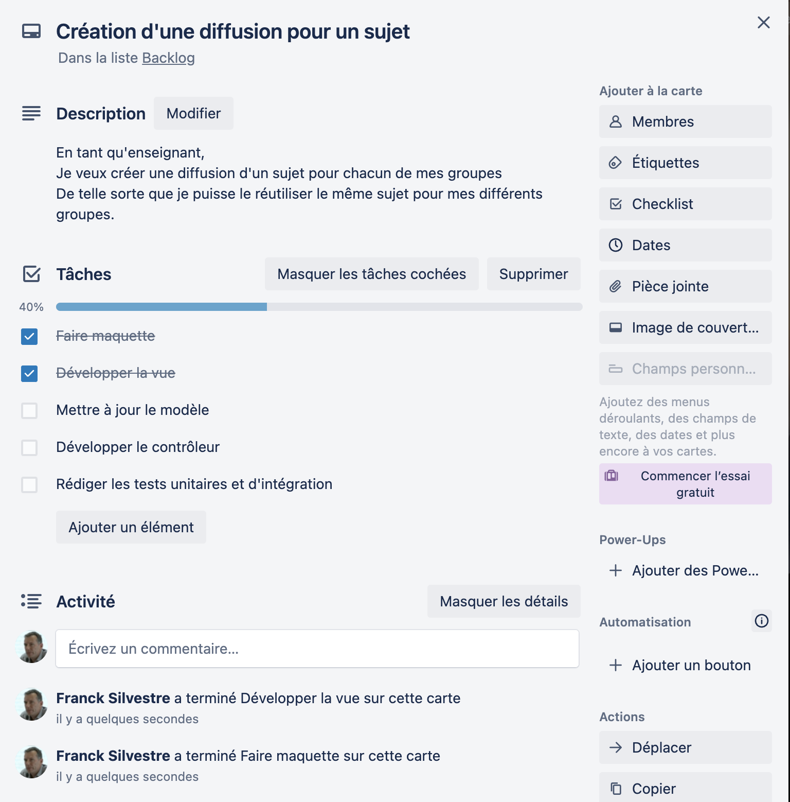

== Les exigences en contexte agile Scrum

=== Scrum - the big Picture

.Scrum
image::002-Scrum.png[Scrum, 800]

=== Le Product owner

* Dans une équipe Scrum, le Product Owner est chargé de maximiser la valeur du produit et le travail de l'équipe de développement.
* Le Product Owner est le représentant du client et des parties prenantes au sein de l'équipe
* Il gère le "Backlog" de produit qui contient toutes les exigences du produit

=== Le backlog produit

* Le Backlog de produit est une liste ordonnée de tout ce qui pourrait être requis dans le produit.
* Il est la source unique des exigences pour tous les changements à effectuer sur le produit.
* Le Product Owner est responsable de ce Backlog, de son contenu, de sa publication ainsi que de l’ordonnancement des items qu’il contient.

=== Items de backlog

* Items d'exigences fonctionnelles : "User Stories"
* Items d'exigences techniques : "Technical Stories", "Enablers", "Spikes"
* Autres exigences : qualité, "omniprésentes", référencées par les items du backlog
** définition de fini
** autres exigences dans documents tiers 

=== User story - Format type

[quote]
____
As a ... +
I want to... +
So that... +
____

[%step]
[quote, Extrait du backlog d'Elaastic]
____
As a teacher +
I want to duplicate an assignment +
So that I can replay questions to another group of students +
____

=== User story et le principe des 3C

Card:: Une US doit « tenir » sur un post-it => elle est nécessairement incomplète.
Conversation:: Pour obtenir les informations détaillées une conversation entre l’équipe de développement et le Product Owner est indispensable.
Confirmation:: À l’issue des échanges des tests d’acception doivent compléter l’US. Des maquettes basse ou moyenne fidélité peuvent compléter l’US.

=== User story - critères INVEST

* Indépendante (le plus possible)
* Négotiable
* Apporter de la Valeur
* Estimable
* Small enough
* Testable

=== Outils pour la gestion du backlog 

* Tableur 
* Outil de _bug tracking_ (JIRA, Issues Github, etc.)
* Outil de board agile (Trello, Github Projects, Zenhub, etc.)

=== De l'exigence à la tâche

WARNING: Les items du backlogs sont des exigences, pas des tâches !

IMPORTANT: La planification requiert la traduction des exigences en tâches à réaliser

=== Exigences et tâches dans Trello

.Trello, US et tâches

==== Étude d'exemples

Le document "example-user-stories.pdf" disponible dans les ressources contient l'ensembles des US qui ont été écrite pour la réalisation de la première version du site de l'Alliance Agile.

Parmi les US, dans partie "Courses and Events", certaines US sont surlignées en vert, d'autres en orange.

https://cours22-23.ut-capitole.fr/course/view.php?id=14299[Activité elaastic : Exemples de *User stories*...]

=== Tests d'acceptation

* Tests fonctionnels
** Plusieurs tests décrits pour chaque story
*** cas nominal
*** cas limites
*** cas d’erreur
* Un format privilégié

[%step]
 Given...
 When...
 Then...

[%step]
* http://guide.agilealliance.org/guide/gwt.html 

=== Tests d’acceptation + revue = recette incrémentale

* Les US + les tests d'acceptation = exigence détaillée 
* Recette incrémentale
* Allègement de la recette finale

=== Exemples d'US avec tests d'acceptation

* https://github.com/TSaaP/tsaap-notes/issues/145 
* https://github.com/TSaaP/tsaap-notes/issues/148 
* https://github.com/TSaaP/tsaap-notes/issues/149 

=== Feature

* Une feature est une fonctionnalité de plus haut niveau qu'une story
* Nécessite un raffinement, découpage en stories
* Niveau intermédiaire entre la vision produit et la story

=== Epic (épopée)

* Dans XP ou Github Projects : une grosse story, un regroupement de stories <~> feature
* Dans d'autres contextes (Scrum à grand échelle), un regroupement de features 

=== Le backlog de Sprint

* Le backlog de Sprint est l’ensemble des items choisis pour le Sprint accompagné du plan pour les réaliser dans le cadre d’un incrément de produit qui concrétisera l’objectif du Sprint.
* Le plan se décline concrètement par un découpage en tâche de chaque item du backlog de Sprint

[%step]
https://github.com/TSaaP/tsaap-notes/issues/180 

=== L'incrément

* L’incrément est la somme de tous les items du Backlog de produit terminés pendant un sprint, additionné de tous les items terminés des sprints précédents.
* Il doit être dans un état utilisable, que le Client décide de le déployer ou non.

=== La définition de fini, pourquoi ?

[quote, https://saat-network.ch/2012/11/sample-definition-of-done/]
____
Project Manager: Is this function done?

Developer: Yes

Project Manager: So we can ship it?

Developer: Well, No. It needs to be tested, and I need to write some documentation, but the code works, really. I tested it… (pause) …on my machine.
____

=== La définition de fini

* Décrit à quelle condition un travail est considéré comme terminé
* Partagée par toute l'équipe Scrum 
* Portée : item de backlog ou incrément
* Évaluation systématique du caractère terminé d'un travail
* La définition de "fini" peut/doit évoluer dans le temps

=== Activité sur la définition de fini 

En mode "_think, pair, share_"

|===
|Critère | Portée 

|Le code est publiée sur la branche principale du dépôt Git partagé
|Item de backlog

|L’incrément est déployé sur l’environnement de test
|Incrément

|...
|
|===

